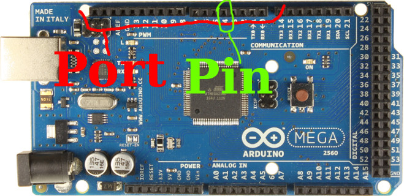

# Arduino Introduction
So, at what level of expertise are you? Absolute beginner? No worries, It might
be tough going, but I'm sure a smart person like yourself should be able to follow along
! :D

WARNING: There are code snippets throughout the text, I won't have introduced
the language in which you program until later, just take a look and see whether
you can understand any of the code. It's meant to be somewhat understandable to
non programmers. Once you've finished the introduction you should be able to
understand any of the code snippets throughout.

When I introduce the syntax for the language I use a name inside square brackets
to represent something that should be replaced. For example `[type] [name];` could be
realised as `int x` when I tell you that an `int` is a `type`, and a `name` can be
anything in English that doesn't have spaces in it or punctuation characters other
than an underscore.

## Hardware
The Arduino is a microcontroller, this is essentially like a mini-computer. In
one sense it's rather like any laptop, tablet or PC you use, in that at the
lowest level they turn things on and off. However, the way you use them couldn't
be more different!

Microcontrollers aren't clever, you have to instruct them on how to
do things, they're fundamentally stupid. You're the one who programs the
brains; you're the clever one.

We'll go over the basic features of the Arduino, how they are used, and what you
can use them for.

### Pins and Ports
Pins are part of a port, you can plug things into them. Once you've plugged
something in to them, you can use them as:

* Input: take in information from the real world.
* Output: control things like lights, motors etc.

To use a pin you have to tell the Arduino whether you'll use it as an input or
an output. We use the `pinMode` function to do this.

void setup() {
    // Set pin 10 as an output
    pinMode(10, OUTPUT);
    pinMode(3, INPUT);
}


On the Arduino there are two types of pins:

* Analog pins (they can read a large range of values: from 0-1023)
* Digital pins (they can only read two values: 0 and 1)

A digital value is one of two values: 0 or 1, false or true. In contrast, Analog
values make up a range, in theory this range is infinitely large, in practice
the Arduino can only handle 1024 values (this is a limit of it's hardware). This
is plenty for most applications, so don't despair...

Once we've set up the mode for a pin, we can go ahead and actually read input
from it, or write some output to it.

void setup() {
    // Both of these pins are digital pins, analog pins are assumed to be inputs
    pinMode(10, OUTPUT);
    pinMode(3, INPUT);
}

void loop() {
    // Depending on how you want to think about it:
    // Turn pin 10 on
    // or
    // Set pin 10 to the value: HIGH
    // or
    // Set pin 10 to the value: True
    // or
    // Set pin 10 to the value: 1
    // they all mean the same thing.
    // If we hook up an LED to pin 10, it'd be lit up
    digitalWrite(10, HIGH);

    // This will be either 0 or 1 depending on the voltage on pin 3.
    // If the voltage on pin 3 is 5v then digitalRead(3) will be 1/true
    // If the voltage on pin 3 is 0v then digitalRead(3) will be 0/off
    int pinThreeValue = digitalRead(3);

    // Here we're reading the analog value from pin 1 on the analog port
    // This will be a value in the range 0--1023.
    // Notice we didn't have to set this up in 'setup()' as it's an analog pin.
    // Analog pins can only act as inputs.
    int analogPinOneValue = analogRead(1);
}


## Programing Language
The Arduino is programmed in a language called `C`. It's rather low level, this
means that it doesn't hold your hand that much; you have to do a lot of things
yourself that other languages would automatically do for you. This is a good
thing for microcontrollers as it gives you very fine control.

Throughout this section I'll refer to the syntax of `C`, by 'syntax' I'm talking
about the grammar; how you can construct valid sentences. If you violate `C`s syntax
you will receive errors in the Arduino program, and your code won't run. You
have to correctly state what you want the Arduino to do, if you don't it will
complain that it doesn't understand how to interpret what you wrote.

### Variables
A variable is a bit of memory that stores a value. All values are stored as 1s
and 0s, so for `C` to know how to interpret the 1s and 0s you have to state what
you're storing in your variable.

The syntax for defining variables is: `[type] [name] = [value];`

I'll declare some variables to give you a taste of what's possible:

// int is a type that holds an integer, a whole number
int wholeNumber = 123;
// float is a type that holds a decimal number, one with a decimal point
float decimal = 23.4123;

// There are other types like 'byte', 'short', 'long', 'double'
// these are out of the scope of this introduction, but they do
// very similar things to the above but can store larger or smaller numbers
// they're mainly used when you're dealing with BIG numbers, or need to save
// lots of memory space


### Statements and Expressions
A statement takes the form: `expression;`, expressions are things like:

* `3 + 1`
* `a = 3` Assign 3 to the variable 'a'
* `pinMode(3, INPUT)` 'Set pin 3 as an input'

They become statements when you put a semi-colon on the end. Expressions will
evaluate to values:

* `3 + 1` evaluates to 4
* `a = 3` evaluates to 3
* `pinMode(3, INPUT)` evaluates to something (maybe 0, maybe 13? We just don't
  know!), whatever it evaluates to, it doesn't matter because we don't care
  about what it returns; we care about what it does: set a pin as an input.

### Functions
Functions are an incredibly useful tool. They allow you to wrap up a set of
statements and give them a name. I'm going to show you how to write a function
`flash()` that turns an LED on and off.

Functions take the form `[return type] [name]()`


// We define the function flash 
void flash() {
    // Pin 13 is the on board LED on an Arduino
    digitalWrite(13, HIGH);
    // Leave the LED on for 0.5s = 500 microseconds
    delay(500);
    // Turn the LED off
    digitalWrite(13, LOW);
    // Leave it off for 0.5s
    delay(500);
}


We can now 'call' (run) the function:


void setup() {
    pinMode(13, HIGH);
}

void loop() {
    // Functions are run by writing their name followed by ()
    flash();    
}
void flash() {
    // Pin 13 is the on board LED on an Arduino
    digitalWrite(13, HIGH);
    // Leave the LED on for 0.5s = 500 microseconds
    delay(500);
    // Turn the LED off
    digitalWrite(13, LOW);
    // Leave it off for 0.5s
    delay(500);
}


I haven't been entirely honest with you. Functions can also take *parameters*,
these allow you to take values into the function. I'll show you a simple
function with a parameter, it should make the concept clearer.


// double returns an int (a whole number), we could assign this to a variable if
// we wanted
int double(int number) {
    // Remember I said that everything evaluates to a value, well functions with
    // return types that aren't `void` return a meaningful value, in this
    // function we've decided that it will return the double of the number we
    // pass into it
    return number * 2;
}

// Functions with parameters are run much like those without:
// [name]([value]);
// double(2) will return 4;
// double(10) will return 20;
// x is 2
int x = 2;
// we reassign x to be double(2) which evaluates to 4.
x = double(x);


## Conditionals: "if this, then do that, else do this"
Conditionals are one of the great things about programming, they're a way to
make your code a little more human, make it decide things! I found it to be one
of the most exciting things when I first learnt to program.

The idea looks like this:

    if (something is true)
        then do this
    else
        do this instead

There's nothing mysterious about this, you do it all the time when you talk to
people: "If I get up on time, I'll eat breakfast, otherwise I'll skip it"

Let's put that logic into the above form:
    if (i get up on time)
        then eat breakfast
    else
        skip breakfast

We can transform that to the equivalent `C` code, imagine we had some functions:
`eatBreakfast()`, `skipBreakfast()` and a variable `gotUpOnTime` that is `1` if
you got up on time, otherwise is `0`.

    // 1 means True
    if (gotUpOnTime == 1) {
       // Invoke a function that 'eats breakfast'
       eatBreakfast();
    } else {
       skipBreakfast();
    }

So we've looked at some examples that you might face in reality, but how can we
use this tool to leverage the features of a microcontroller? Well. We'll use it
to interact with the world of course! Lets do something simple to begin with.
Imagine you have a light sensor hooked up that gives a `1` when there is light
shining on it, and `0` when it's dark. We'll also hook up and LED to the
microcontroller so that it can respond to the input from the light sensor.


void setup() {
    pinMode(5, INPUT);
    pinMode(13, OUTPUT);
}

void loop() {
    // if it's light
    if (digitalRead(5) == 1) {
        // Turn the LED off
        digitalWrite(13, LOW);
    } else {
        // Turn the LED on
        digitalWrite(5, HIGH);
    }
}


Ta Da! We now have a very simple porch light. When it's dark the LED will turn
on. If it's light, then the LED will turn off. There are loads of really
simple problems that can be solved like this, you just have to have the creative
to see the applications of microcontrollers. Just because something is simple
it doesn't mean you're not clever for solving it. In fact, I'd go as far as
saying if you see something that hasn't been solved that is simple, you're 
clever! Others would just shrug and put up with the problem.

That's probably enough for the moment. You should be sufficiently equipped to do
well in the workshop if you understood the material. You can find more on the
[Arduino website](http://www.arduino.cc). 
