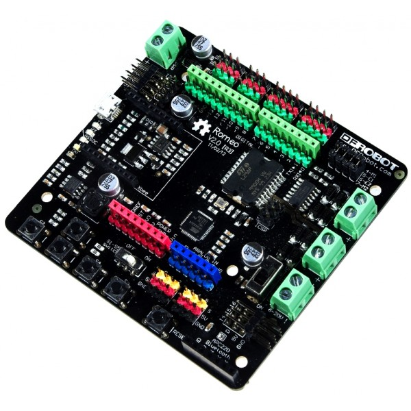

You can find the parts listed here from different suppliers (possibly at a
better price, although I have tried hard to find well priced parts). 

Arduino 2WD platform/base (also known as a turtle) can be bought from:

* [Seeed](http://www.seeedstudio.com/depot/2WD-Arduino-compatible-Mobile-platform-p-657.html?cPath=48)
  (recommended, slow shipping)
* [Cool
  components](http://www.coolcomponents.co.uk/2wd-arduino-compatible-mobile-platform.html?gclid=CP6hubCvp70CFWvjwgodRo0AMg) (UK based, more expensive)
* [DRoboticsOnline](http://www.ebay.co.uk/itm/Turtle-2WD-Mobile-Platform-/131133909326?pt=UK_ToysGames_RadioControlled_JN&hash=item1e8830a94e)
  (UK based, more expensive)

Sharp GP2YOA21 10-80cm distance sensor, this looks to be the one that is on the
robots used in the workshops but I can't confirm.

* [RoboSavvy](http://robosavvy.com/store/product_info.php/cPath/2020/products_id/1481)
* [Cool
  components](http://www.coolcomponents.co.uk/ir-range-sensor-sharp-20cm-150cm.html?gclid=CKPwsNLWqb0CFSMOwwod9n4AHQ)
  (This is a different sensor with a range of 20cm to 150cm)

Pan and tilt servo bracket for mounting the IR distance sensor

* [Cool components](http://www.coolcomponents.co.uk/pan-and-tilt-kit-no-servos.html#.)

Servo motor to turn the servo bracket. These can be had for much cheaper
elsewhere.

* [Cool components](http://www.coolcomponents.co.uk/servo-motor-hs-422.html)

The brains of it all! This is essentially an Arduino development board merged
with a motor controller board.

* [RoboSavvy](http://robosavvy.com/store/product_info.php/products_id/3908)
