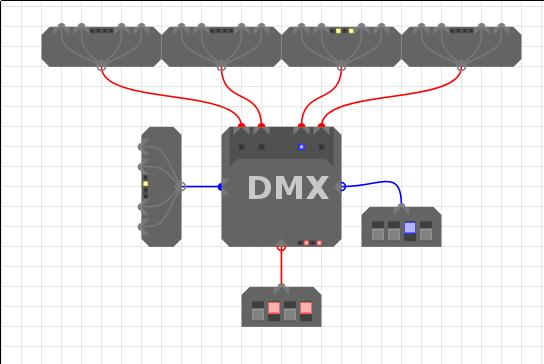
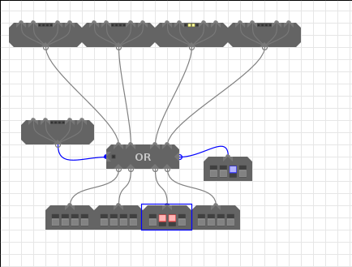
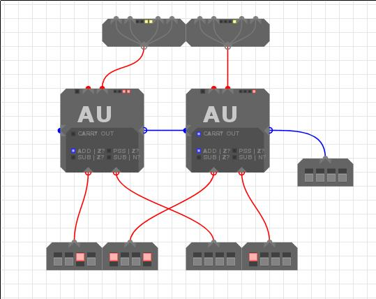

* `x`s indicate that the binary digit doesn't matter, it can be 1 or 0.
* [Examples of components](module-sim-examples.modsim)

# Split Merge

| xxDC |      |      | DCBA |
|------|------|------|------|
| **xxxD** | **xxDC** | **xxxB** | **xxBA** |

| **xxBA** | **xxxB** | **xxDC** | **xxxD** |
|------|------|------|------|
| **DCBA** |      |      | **xxDC** |

## Merge (4 inputs)

This example seems to demonstrate an error in the merge code. Decompiling 
yields some rather strange code that updates the outputs. Perhaps this is
undefined behaviour!? This is the problem of not having any official
documentation.

This is quite simple. Each of the 4 inputs represents a bit of a 4 bit word. A
is the LSB and D the MSB. The 4 bit word is constructed in output A.

Output B will only produce a word of the form `xxDC` or `xxC2C1` where `D` is the LSB of
input D; the same goes for input C.

## Split (4 outputs)

Port A splits out each bit to the LSB of the output in order (A from port A -> LSB of output
A), however it is not quite this simple as on output A and C the 2nd and 4th
bits from port A are also present in the 2nd LSB. so 00BA into Port A yields
00BA on output A. This is a bit irritating meaning you'll have to use a bit mask
to get at A, or perform a bit of shifting. Refer to the top table if this
explanation is crap.

# 4 Way Fanout

Takes an input and repeats it to four outputs

# REG - Register

These store their inputs when enabled, and constantly output whatever is stored
in them. The control input takes the following form:

| Bit | Function | Values and outputs |
|-----|----------|--------------------|
| 0   | Clock    | 0 - no change, 1 - read input if enable=1 |
| 1   | Reset    | Reset the register to 0 |
| 2   | Enable   | 0 - no change, 1 - read input if clock=1 |

# CLK - Clock

Outputs two clock signals which are the inverse of each other, advancing through
four phases as shown in the table below. The clock is also the source of the
asynchronous reset signal for any registers in your design

| Bit | Output 1 | Output 2 |
|-----|----------|--------- |
| 0   | 0        | 0        |
| 1   | 1        | 0        |
| 2   | 0        | 0        |
| 3   | 0        | 1        |

- *NB 1: Sends a 1 when reset is pressed*
- NB 2: The enable bit **defaults to 1 if left disconnected**.
  Because the third clock bit is an 'x' this is fine when connected directly to
  the clock. Connecting the clock to a register via a component that always drives
  either 1 or 0 (such as a fan out) *without manually adding in an enable
  signal* will result in the clock being permanently disabled.

# LSH - Left Shift

NOTE: Only the 2 LSBs of *control input* are handled

Take and input and shift it left by the number of places in the *control input*. No
idea what the chain in and outs do. If you do know, please email me and I'll add
it in.

# RSH - Right Shift

NOTE: Only the 2 LSBs of *control input* are handled

Take the input and shift it right by the number of places in the *control
input*. No idea what the chain in and outs do.

# MUX - Multiplexer

The multiplexer takes 4 inputs and selects one of them based on the 2 LSBs of
the *Control in*, which is also fed out to *Control out*.

| Control input | Input selected |
|---------------|----------------|
| xx00          | A              |
| xx01          | B              |
| xx10          | C              |
| xx11          | D              |

# DMX - Demultiplexer

The demultiplexer takes an input and then based on the *Control input* selects
which output to route it to.

| Control input | Output selected |
|---------------|-----------------|
| xx00          | A               |
| xx01          | B               |
| xx10          | C               |
| xx11          | D               |

# Chained Or

The chained Or is triggered in one of two ways:
1. If the control in has it's LSB set
2. If any of the inputs have their LSB set
otherwise the output will be 0000.

The chained or is so called as along the top of the module you get the inputs
just as you fed them in, this means you can pass the lowest bits around quite a
lot.

# AU - Arithmetic Unit

Performs arithmetic operations on two inputs.

| Control Inputs (right input) | Function selected | Comparison selected | 
|------------------------------|-------------------|---------------------|
| x000                         | Addition          | Output = 0          |
| x001                         | Pass through A    | Output = 0          |
| x110                         | A - B             | A = B               |
| x111                         | A - B             | A < B               |

Subtraction is carried out by performing `(A + ¬B) + 1` since `-B = ¬B + 1` in
the two's complement system.

The left output is the *Control out* that instructs another chained AU that
overflow has occured so you can chain AUs to handle more than 4 bit numbers.

# LU - Logic Unit

Performs logical operations on two inputs.

| Control input | Function selected |
|---------------|-------------------|
|  xx00         | Not               |
|  xx01         | And               |
|  xx10         | Or                |
|  xx11         | Xor               |

# RAM - Memory unit
The RAM unit holds 65,536 bytes of memory. These are accessed through the 4
*Address inputs* that take a nibble each. Inputs take the form of nibbles;
the same goes for outputs. 

| Bit | Function |
|-----|----------|
| 0   | Clock    |
| 2   | Enable   |

